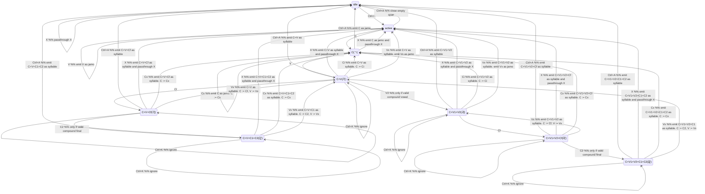

# N-bytes Automaton

This document describes the Hangul payload grammar used inside public `nbytes`
spans in this repository.

Scope:

- Public `nbytes` is mixed text.
- `Ctrl-K` (`0x0b`) starts a Hangul payload span.
- `Ctrl-A` (`0x01`) ends a Hangul payload span.
- Outside a span, bytes pass through unchanged.
- Inside a span, payload bytes are decoded into Hangul text, then transcoded to
  `modified` output.
- Inside a span, the parser consumes bytes incrementally and emits buffered
  output as early as possible.

## Output Model

- ASCII output is emitted as Apple II display bytes with the high bit set.
- Hangul syllables are emitted as 2-byte `modified` code points in the remapped
  syllable range.
- Standalone Hangul jamo are emitted as 2-byte `modified` code points in the
  remapped jamo range.

## Byte Classes

Single-byte consonant bytes:

- `C`: consonants
  `ㄱㄲㄴㄷㄸㄹㅁㅂㅃㅅㅆㅇㅈㅉㅊㅋㅌㅍㅎ = Rr-SEe=FAQq*Tt<DWw>CZXVG`
  regex: `[Rr\-SEe=FAQq*Tt<DWw>CZXVG]`

Final-capable consonant bytes:

- `Cf`: valid final consonants
  `ㄱㄲㄴㄷㄹㅁㅂㅅㅆㅇㅈㅊㅋㅌㅍㅎ = Rr-SEFAQTt<DWCZXVG`
  regex: `[Rr\-SEFAQTt<DWCZXVG]`

Initial-only consonant bytes:

- `Ci`: valid only as initials
  `ㄸㅃㅉ = e=q*w>`
  regex: `[e=q*w>]`

Compound final byte pairs:

- `C1`: first byte of a compound final
  `ㄱㄴㄹㅂ = R,S,F,Q`
  regex: `[RSFQ]`
- `C2`: recognized compound final byte pairs

Legacy note:

- compound vowel pairs such as `HK` are only combined when the parser is
  already in a syllable medial position after an initial consonant
- a standalone sequence such as `HK` is emitted as `ㅗㅏ`
- legacy `nbytes` is therefore lossy for some standalone compound vowels and
  compound final clusters when mapped to Unicode
  `ㄳㄵㄶㄺㄻㄼㄽㄾㄿㅀㅄ = RT,SW,SG,FR,FA,FQ,FT,FX,FV,FG,QT`

Single-byte vowel bytes:

- `V`: vowels
  `ㅏㅐㅑㅒㅓㅔㅕㅖㅗㅛㅜㅠㅡㅣ = KOIoJPUpHYNBML`
  regex: `[KOIoJPUpHYNBML]`

Compound vowel byte pairs:

- `V1`: first byte of a compound vowel
  `ㅗㅜㅡ = H,N,M`
  regex: `[HNM]`
- `V2`: recognized compound vowel byte pairs
  `ㅘㅙㅚㅝㅞㅟㅢ = HK,HO,HL,NJ,NP,NL,ML`

Other payload bytes:

- `X`: any payload byte matching `[^A-Zrtqtwop]`
  This is equivalent to "any payload byte that is not in `C` or `V`".

## Operational Notes

- The parser is byte-by-byte and streaming.
- It buffers only enough state to decide whether the current byte extends the
  current Hangul composition.
- Examples:
  `H,K -> ㅘ`, `H,O -> ㅙ`, `R,T -> ㄳ`, `F,G -> ㅀ`
- Composition is greedy as `L V [T]`, but buffered output is emitted as soon as
  the next input byte makes the current composition complete or no longer
  extendable.
- If a candidate final consonant is followed by a vowel and can also be used as
  an initial, that consonant starts the next syllable instead of closing the
  previous one.
- An isolated consonant emits a jamo.
- An isolated vowel emits a jamo.
- `X` inside an active span passes through literally and resets the buffered
  Hangul state to `S1`.
- `Ctrl-K` inside an active span is ignored and does not change the current
  buffered Hangul state.

## State Meanings

- `S0`: idle, outside a payload span
- `S1`: active, inside a payload span with no buffered Hangul token
- `S2`: buffered initial consonant `C`
- `S3`: composed `C + V`
- `S4`: composed `C + V + Cf`
- `S5`: composed `C + V + C2`
- `S6`: composed `C + V2`
- `S7`: composed `C + V2 + Cf`
- `S8`: composed `C + V2 + C2`

Representative examples:

- `S2`: `ㄱ`
- `S3`: `가`
- `S4`: `각`
- `S5`: `갃`
- `S6`: `과`
- `S7`: `곽`
- `S8`: `곿`

The `V1`, `V2`, `C1`, and `C2` labels describe incrementally recognized byte
patterns inside the stream. They are parser categories used by the automaton,
not a separate tokenization stage.

## Automaton

Interpretation:

- The automaton consumes one input byte at a time.
- Transition labels `C`, `Cf`, `Ci`, `V`, and `X` classify the current input
  byte.
- Transition labels `V2` and `C2` mean that the current input byte, together
  with the immediately preceding buffered `V1` or `C1`, completes a recognized
  compound vowel or compound final pair.
- State names such as `C+V1+V2` describe buffered recognition history. The
  representative Hangul examples describe the composed result if that state is
  flushed.

Conventions:

- `Cx`: next consonant byte from `C`
- `Vx`: next vowel byte from `V`
- `C := ...`: replace the buffered consonant with the given byte or recognized
  consonant pair
- `V := ...`: replace the buffered vowel with the given byte or recognized
  vowel pair
- `Ctrl-A` from `S2`..`S8` flushes the buffered Hangul output, then closes the
  span
- `Ctrl-A` from `S0` passes through unchanged
- `Ctrl-A` from `S1` closes an empty active span
- "emit ... and passthrough X" means flush the buffered Hangul output, then emit
  `X` literally inside the active span



## Examples

Notation:

- `<K>` = `Ctrl-K` = `0x0b`
- `<A>` = `Ctrl-A` = `0x01`

Simple syllable:

```text
input nbytes:   <K>RK<A>
payload bytes:  R K
byte meaning:   ㄱ ㅏ
utf8 output:    가
ucs2 output:    AC00
modified hex:   4C00
```

Final consonant:

```text
input nbytes:   <K>RKR<A>
payload bytes:  R K R
byte meaning:   ㄱ ㅏ ㄱ
utf8 output:    각
ucs2 output:    AC01
modified hex:   4C01
```

Compound vowel:

```text
input nbytes:   <K>RHK<A>
payload bytes:  R H K
byte meaning:   ㄱ ㅗ ㅏ   ; H,K extends ㅗ to ㅘ while buffered
utf8 output:    과
ucs2 output:    AC1C
modified hex:   4C1C
```

Compound vowel plus final:

```text
input nbytes:   <K>RHOS<A>
payload bytes:  R H O S
byte meaning:   ㄱ ㅗ ㅐ ㄴ ; H,O extends ㅗ to ㅙ while buffered
utf8 output:    괜
ucs2 output:    AC39
modified hex:   4C39
```

Doubled initial:

```text
input nbytes:   <K>rK<A>
payload bytes:  r K
byte meaning:   ㄲ ㅏ
utf8 output:    까
```

Compound final:

```text
input nbytes:   <K>rKr<A>
payload bytes:  r K r
byte meaning:   ㄲ ㅏ ㄲ
utf8 output:    깎
```

Standalone compound vowel jamo:

```text
input nbytes:   <K>HK<A>
payload bytes:  H K
byte meaning:   ㅗ ㅏ
utf8 output:    ㅘ
```

Standalone compound final jamo:

```text
input nbytes:   <K>RT<A>
payload bytes:  R T
byte meaning:   ㄱ ㅅ
utf8 output:    ㄳ
```

Mixed ASCII and Hangul spans:

```text
input nbytes:   ABC<K>GKS<A><K>RNR<A>123
utf8 output:    ABC한국123
```

Empty span:

```text
input nbytes:   A<K><A>B
utf8 output:    AB
```

Stray terminator outside a span:

```text
input nbytes:   A<A>B
utf8 output:    A^AB      ; literal Ctrl-A passes through unchanged
```

ASCII-safe punctuation inside a span:

```text
input nbytes:   <K>RK!<A>
payload decode: 가!
utf8 output:    가!
```

ASCII passthrough inside a span:

```text
input nbytes:   <K>@<A>
payload decode: @
utf8 output:    @
```

Ignored nested start delimiter inside a span:

```text
input nbytes:   <K>R<K>K<A>
payload decode: 가
utf8 output:    가
```

Unterminated span:

```text
input nbytes:   <K>RK
status:         invalid incomplete span; closing Ctrl-A is required
```
